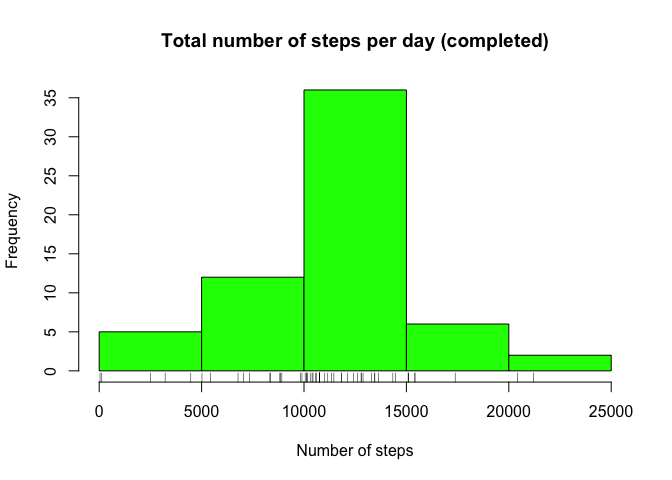

# Reproducible Research: Peer Assessment 1


## Loading and preprocessing the data

Load libraries

```r
library(dplyr)
```

```
## 
## Attaching package: 'dplyr'
## 
## Die folgenden Objekte sind maskiert von 'package:stats':
## 
##     filter, lag
## 
## Die folgenden Objekte sind maskiert von 'package:base':
## 
##     intersect, setdiff, setequal, union
```

```r
library(lattice)
```
     

Read the data from csv-file and store in variable 'act'

```r
act <- read.csv("activity.csv")
```
  
     
## What is mean total number of steps taken per day?  
group by days

```r
dys <- group_by(act, date)
```

sum up the steps per day

```r
sum_steps <- summarise(dys, steps = sum(steps))
```

mean and median of the total number of steps per day

```r
mean_median_steps <- summarise(dys, mean_steps = mean(steps, na.rm=T), median_steps = median(steps, na.rm=T))
```

date          mean_steps   median_steps
-----------  -----------  -------------
2012-10-01            NA             NA
2012-10-02     0.4375000              0
2012-10-03    39.4166667              0
2012-10-04    42.0694444              0
2012-10-05    46.1597222              0
2012-10-06    53.5416667              0
2012-10-07    38.2465278              0
2012-10-08           NaN             NA
2012-10-09    44.4826389              0
2012-10-10    34.3750000              0
2012-10-11    35.7777778              0
2012-10-12    60.3541667              0
2012-10-13    43.1458333              0
2012-10-14    52.4236111              0
2012-10-15    35.2048611              0
2012-10-16    52.3750000              0
2012-10-17    46.7083333              0
2012-10-18    34.9166667              0
2012-10-19    41.0729167              0
2012-10-20    36.0937500              0
2012-10-21    30.6284722              0
2012-10-22    46.7361111              0
2012-10-23    30.9652778              0
2012-10-24    29.0104167              0
2012-10-25     8.6527778              0
2012-10-26    23.5347222              0
2012-10-27    35.1354167              0
2012-10-28    39.7847222              0
2012-10-29    17.4236111              0
2012-10-30    34.0937500              0
2012-10-31    53.5208333              0
2012-11-01           NaN             NA
2012-11-02    36.8055556              0
2012-11-03    36.7048611              0
2012-11-04           NaN             NA
2012-11-05    36.2465278              0
2012-11-06    28.9375000              0
2012-11-07    44.7326389              0
2012-11-08    11.1770833              0
2012-11-09           NaN             NA
2012-11-10           NaN             NA
2012-11-11    43.7777778              0
2012-11-12    37.3784722              0
2012-11-13    25.4722222              0
2012-11-14           NaN             NA
2012-11-15     0.1423611              0
2012-11-16    18.8923611              0
2012-11-17    49.7881944              0
2012-11-18    52.4652778              0
2012-11-19    30.6979167              0
2012-11-20    15.5277778              0
2012-11-21    44.3993056              0
2012-11-22    70.9270833              0
2012-11-23    73.5902778              0
2012-11-24    50.2708333              0
2012-11-25    41.0902778              0
2012-11-26    38.7569444              0
2012-11-27    47.3819444              0
2012-11-28    35.3576389              0
2012-11-29    24.4687500              0
2012-11-30           NaN             NA

histogram of the total number of steps per day

```r
hist(sum_steps$steps, col='green', main = "Total number of steps per day", xlab = "Number of steps")
rug(sum_steps$steps)
```

 

## What is the average daily activity pattern?
group by interval and calculate mean

```r
intvls <- group_by(act, interval)
ave_steps <- summarise(intvls, average = mean(steps, na.rm = T))
```

plot time series

```r
plot(ave_steps$interval, ave_steps$average, type = "l", col="red", xlab = " interval", ylab = "average number of taken steps")
```

 

The maximum average number of steps (206.169) is in interval 835

```r
mx <- max(ave_steps$average)
mx_f <- filter(ave_steps, average == mx)
result_interval <- mx_f$interval
```

----
 835
----

## Imputing missing values
get the total number of NAs (2304)

```r
my_na <- is.na(act)
sum_my_na <- sum(my_na)
```

get NAs of act

```r
nas <- filter(act, is.na(steps))
```

get mean-values for NAs

```r
mean_nas <- merge(nas, ave_steps, by='interval', all.x = T)
```

rename and order cols

```r
missing_steps <- select(mean_nas, steps = average, date, interval)
```

get the no NAs in act

```r
no_nas <- filter(act, !is.na(steps))
```

combine both tables to get a dataset with the missing data filled in

```r
act_full <- rbind(no_nas, missing_steps)
```

Order the rows

```r
act_full <- arrange(act_full, date, interval)
```

sum up the steps per day

```r
dys_c <- group_by(act_full, date)
sum_steps_c <- summarise(dys_c, steps = sum(steps))
```

histogram of the total number of steps per day for completed values for steps

```r
hist(sum_steps_c$steps, col='green', main = "Total number of steps per day (completed)", xlab = "Number of steps")
rug(sum_steps_c$steps)
```

 

mean and median of the total number of steps per day with completed values for steps

```r
mean_median_steps_c <- summarise(dys_c, mean_steps = mean(steps, na.rm=T), median_steps = median(steps, na.rm=T))
```

Summary of original dataset

```r
summary(mean_median_steps)
```

```
##          date      mean_steps       median_steps
##  2012-10-01: 1   Min.   : 0.1424   Min.   :0    
##  2012-10-02: 1   1st Qu.:30.6979   1st Qu.:0    
##  2012-10-03: 1   Median :37.3785   Median :0    
##  2012-10-04: 1   Mean   :37.3826   Mean   :0    
##  2012-10-05: 1   3rd Qu.:46.1597   3rd Qu.:0    
##  2012-10-06: 1   Max.   :73.5903   Max.   :0    
##  (Other)   :55   NA's   :8         NA's   :8
```

Summary of completed dataset

```r
summary(mean_median_steps_c)
```

```
##          date      mean_steps       median_steps   
##  2012-10-01: 1   Min.   : 0.1424   Min.   : 0.000  
##  2012-10-02: 1   1st Qu.:34.0938   1st Qu.: 0.000  
##  2012-10-03: 1   Median :37.3826   Median : 0.000  
##  2012-10-04: 1   Mean   :37.3826   Mean   : 4.474  
##  2012-10-05: 1   3rd Qu.:44.4826   3rd Qu.: 0.000  
##  2012-10-06: 1   Max.   :73.5903   Max.   :34.113  
##  (Other)   :55
```

yes, the values differ from the estimates from the first part of the assignment.
The impact of imputing missing data on the the estimates of the total daily number of steps is that mean and the median have the same value. The median of the new data set with completed values has increased compared to the first dataset.   


## Are there differences in activity patterns between weekdays and weekends?

get days of weeks

```r
act_full <- mutate(act_full, day=weekdays(as.Date(act_full$date, '%Y-%m-%d')))
```

indicate weekend or weekday with factor variable

```r
act_full$days_full <- factor(act_full$day, labels = c("weekday", "weekday","weekday","weekday","weekday","weekend", "weekend"))
```

```
## Warning in `levels<-`(`*tmp*`, value = if (nl == nL) as.character(labels)
## else paste0(labels, : duplicated levels in factors are deprecated
```

clean table

```r
steps_days <- select(act_full, steps, date, interval, days = days_full)
```

group for date

```r
date_g <- group_by(steps_days, date)
```

mean for steps

```r
mean_steps <- summarise(date_g, mean_steps = mean(steps))
```

weekdays

```r
steps_weekdays <- filter(steps_days, days == 'weekday')
```

group by interval

```r
intvls_wd <- group_by(steps_weekdays, interval)
ave_steps_wd <- summarise(intvls_wd, average = mean(steps))
```

add column days

```r
ave_steps_wd_d <- mutate(ave_steps_wd, days = "weekday")
```

weekends

```r
steps_weekends <- filter(steps_days, days == 'weekend')
```

group by interval

```r
intvls_we <- group_by(steps_weekends, interval)
ave_steps_we <- summarise(intvls_we, average = mean(steps))
```

add column days

```r
ave_steps_we_d <- mutate(ave_steps_we, days = "weekend")
```

combine weekdays and weekends

```r
ave_steps_all <- rbind(ave_steps_wd_d, ave_steps_we_d)
```

plot two panels for weekend and weekdays

```r
xyplot(average ~ interval | days, data=ave_steps_all, type="l", layout=c(1,2))
```

 
